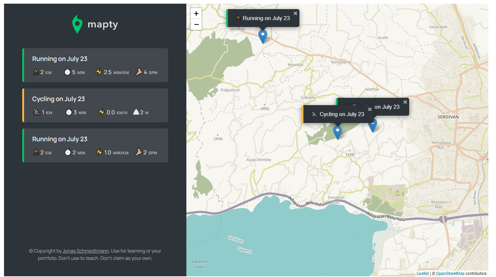

# Mapty

This project helps users track their exercise activity by logging the activity location on the map

Live view: [live](https://mapty-8ms9w4x29-yaya-usman.vercel.app/)

### Built with

- Semantic Html
- Css
- Vanila Javascript
- Leaflet Library
- Geolocation API

### What i learnt

- working with the Geo-location Api
- creating components
- working with the leaflet library
- some new css properties i never knew about was also learnt along the way

**Attribution**

This project is a code-along project from the Javascript Bootcamp course by Jonas Schemdtmann
